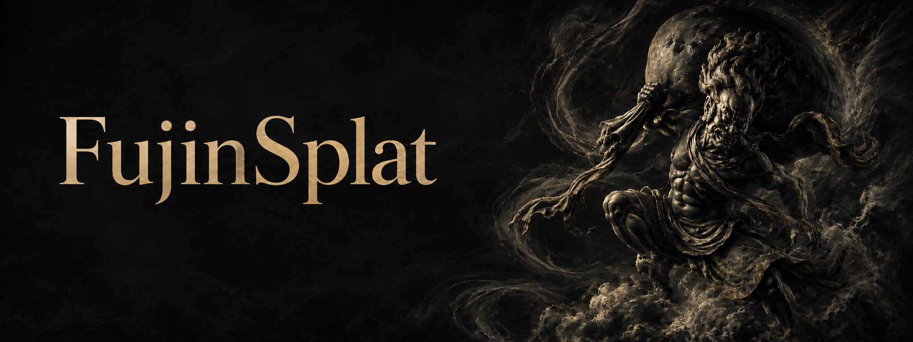
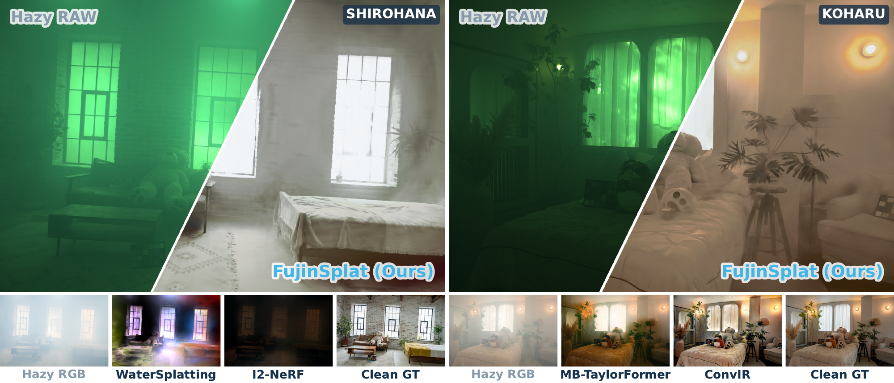
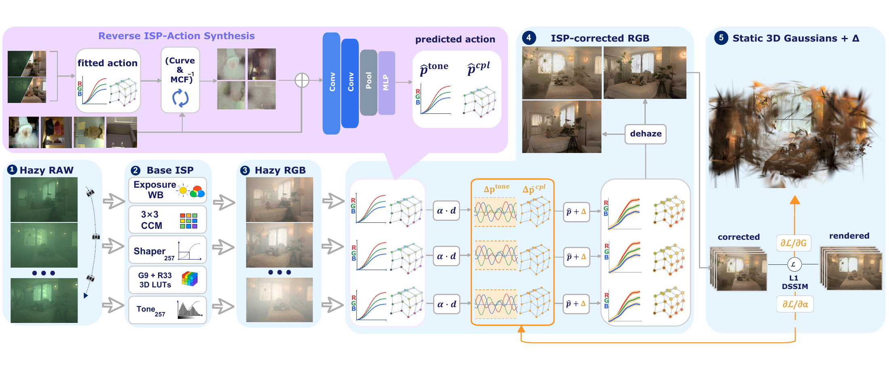
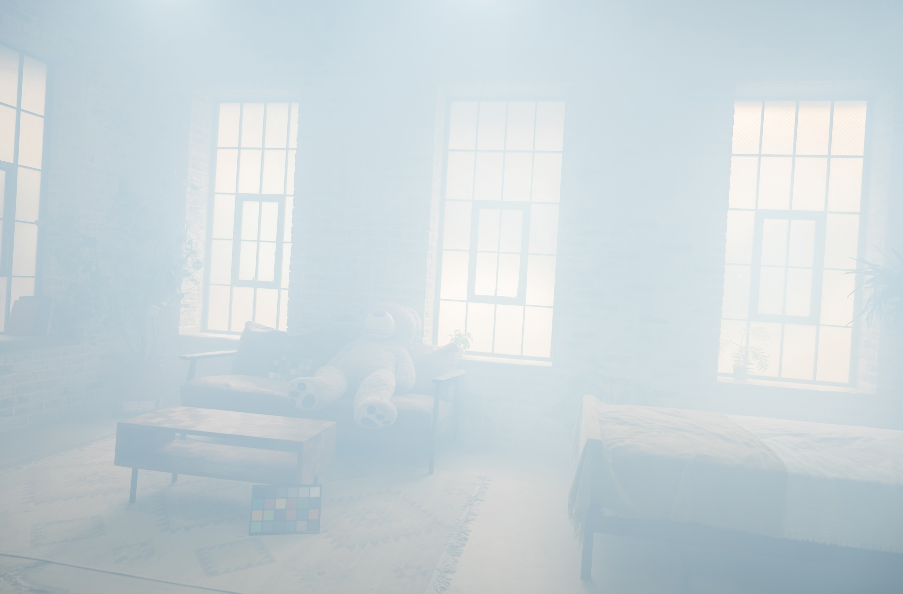
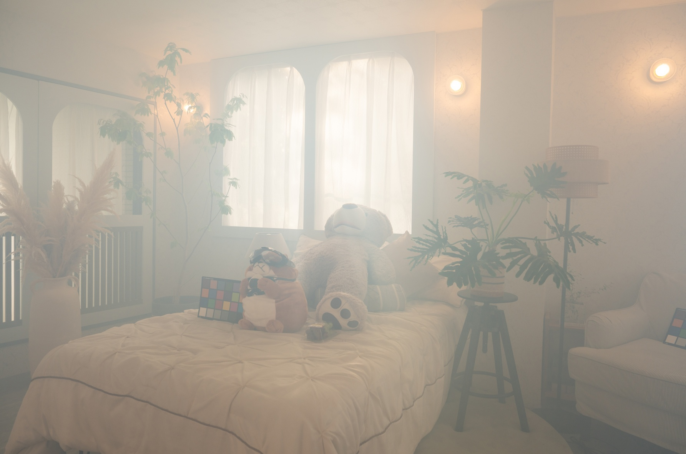
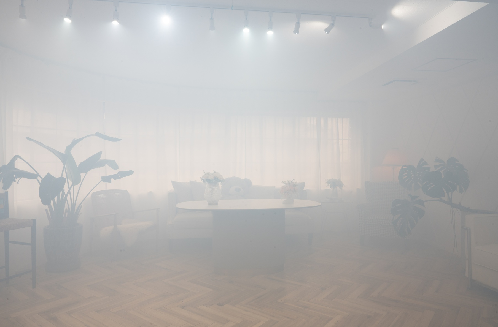
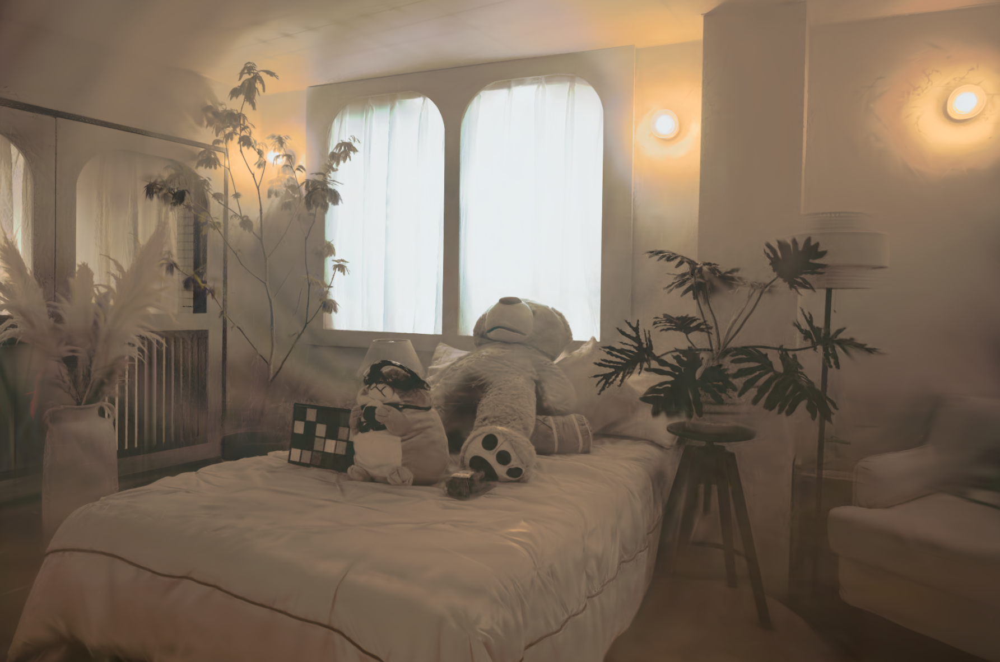

<p align="center">
  
</p>

<p align="center">
  <strong>Seeing Through Smoke with RAW-Domain Gaussian Splatting</strong><br>
  Gengjia Chang · Ziteng Cui · Shuhong Liu
</p>

<h3 align="center">
  <a href="https://arxiv.org/abs/2609.06017" title="Read the paper on arXiv">📄 Paper</a> |
  <a href="https://i2wm.github.io/FujinSplat/">🌐 Project Page</a>
</h3>

## Overview



FujinSplat addresses the problem in the RAW domain, where the two processes remain separable. A per-scene Base ISP is fitted from the scene's hazy RAW captures to its own camera renderings and then frozen, providing a fixed photometric anchor that performs no dehazing. Analyzing expert corrections reveals a compact, low-dimensional correction space identifiable from RAW alone. FujinSplat therefore fits per-view action answers at the training poses and trains a single scene-agnostic controller to regress them from RAW; the corrected views supervise one static 3D Gaussian representation, jointly with a bounded per-view residual that reconciles cross-view photometric inconsistencies. On the RealX3D real-world smoke benchmark FujinSplat clearly outperforms the strongest comparable baseline, ahead of both physics-based reconstruction and restoration-then-3DGS pipelines.

## Method



## Setup

Linux · Python 3.9 · PyTorch 2.0.1 · CUDA toolkit 11.8. Run from the repository root.

```bash
conda create -n fujinsplat python=3.9 -y
conda activate fujinsplat
python -m pip install 'setuptools>=61' wheel
python -m pip install torch==2.0.1 torchvision==0.15.2 \
  --index-url https://download.pytorch.org/whl/cu118
python -m pip install -r requirements/synthesis.txt
python -m pip install --no-build-isolation ./submodules/diff-gaussian-rasterization
python -m pip install --no-build-isolation ./submodules/simple-knn
python -m pip install --no-build-isolation --no-deps -e .
```

CUDA extension sources are bundled in `submodules/`.

### Data and weights

Datasets and pretrained weights will be released after paper acceptance.

RAW is demosaiced sensor RGB without WB or gamma;
NPZ key `linear_rgb` is H×W×3 uint16 or normalized floating point.

```text
DATA_ROOT/
  raw/smoke/SCENE/train/STEM.npz
  rgb/smoke/SCENE/train/STEM.JPG       # hazy camera RGB
  rgb/smoke/SCENE/test/STEM.JPG        # clean evaluation references
  rgb/smoke/SCENE/transforms_train.json
  rgb/smoke/SCENE/transforms_test.json
  rgb/smoke/SCENE/point3d.ply
  weights/controller.pt
  weights/base/SCENE/complete_model.pt
```

Copy `*.example.json` to `*.local.json` and fill in literal paths; relative paths
start at the repository root. Windows paths may use `/`. Local configs are Git-ignored.

## Training

Run the stages below in order, matching each output to the next stage's input.

| Stage | Configuration |
| --- | --- |
| Scene Base ISP | [base.example.json](configs/base.example.json) |
| External RAW acquisition | [acquire.example.json](configs/acquire.example.json) |
| External Base matrix | [external_matrix.example.json](configs/external_matrix.example.json) |
| External clean cache | [external_cache.example.json](configs/external_cache.example.json) |
| Depth-derived transmission | [depth.example.json](configs/depth.example.json) |
| Reverse synthesis | [synthesize.example.json](configs/synthesize.example.json) |
| Controller pretraining | [controller.pretrain.example.json](configs/controller.pretrain.example.json) |

```bash
python -m fujinsplat --config configs/base.local.json --check-only
python -m fujinsplat --config configs/base.local.json
python -m fujinsplat --config configs/acquire.local.json
python -m fujinsplat --config configs/external_matrix.local.json
python -m fujinsplat --config configs/external_cache.local.json
python -m fujinsplat --config configs/depth.local.json
python -m fujinsplat --config configs/synthesize.local.json
python -m fujinsplat --config configs/controller.pretrain.local.json --check-only
python -m fujinsplat --config configs/controller.pretrain.local.json
```

Base calibration runs per scene and requires the original L257 parent weights.
The synthesis stages require 16 calibration ARWs and Depth-Anything-V2-Small
weights; [195-pair statistics and WB](fujinsplat/data/synthesis_prerequisites/MANIFEST.json)
are bundled. The calibration manifest uses schema `fujinsplat.external_raw.v1`
with 16 `rows`: `{"capture_id": "name", "raw": "/path/to/capture.ARW"}`.

The pretraining example follows the paper: fresh initialization, 1500 steps,
batch 16, learning rate 0.0003. Point `scene.local.json` to its `checkpoint.pt`
and the calibrated Base directory before reconstruction.

The downloaded `controller.local.json` is a server warm-start dry run.
For paper pretraining use `controller.pretrain.local.json`; `--check-only`
checks inputs without training. Remove `"check_only": true` from a config to train.

## Reconstruction

Configure `scene.local.json` from [scene.example.json](configs/scene.example.json) with the trained Controller
and Base paths. Update or remove its example hash when changing weights.

```bash
python -m fujinsplat --config configs/scene.local.json
```

This prepares, trains and renders one scene. Repeat with matching `scene` and
paths for all eight scenes, then evaluate:

```bash
python -m fujinsplat --config configs/evaluate.local.json
```

Use [evaluate.example.json](configs/evaluate.example.json) for evaluation or
[render.example.json](configs/render.example.json) to render an existing model.
Scores are written to `RESULT.json` and `held_view_metrics.csv`.

## Results

Paper results: **18.42 dB PSNR · 0.679 SSIM · 0.541 LPIPS**.

<table>
<tr><th>Shirohana</th><th>Koharu</th><th>Futaba</th></tr>
<tr>
<td></td>
<td></td>
<td></td>
</tr>
<tr>
<td></td>
<td></td>
<td></td>
</tr>
</table>

| Scene | PSNR ↑ | SSIM ↑ | LPIPS ↓ |
| --- | ---: | ---: | ---: |
| Akikaze | 19.91 | 0.699 | 0.494 |
| Futaba | 18.88 | 0.763 | 0.485 |
| Hinoki | 16.46 | 0.490 | 0.722 |
| Koharu | 18.85 | 0.705 | 0.517 |
| Midori | 20.11 | 0.749 | 0.479 |
| Natsume | 17.33 | 0.687 | 0.533 |
| Shirohana | 16.68 | 0.570 | 0.581 |
| Tsubaki | 19.15 | 0.771 | 0.517 |
| **Average** | **18.42** | **0.679** | **0.541** |

The seven-scene subset excluding Akikaze reports 18.2083 dB.
[Machine-readable results](configs/paper_results.json).

## Citation

```bibtex
@misc{chang2026fujinsplat,
  title={FujinSplat: Seeing Through Smoke with RAW-Domain Gaussian Splatting},
  author={Chang, Gengjia and Cui, Ziteng and Liu, Shuhong},
  year={2026}
}
```

Built on Graphdeco Gaussian Splatting. See [LICENSE](LICENSE.md).
