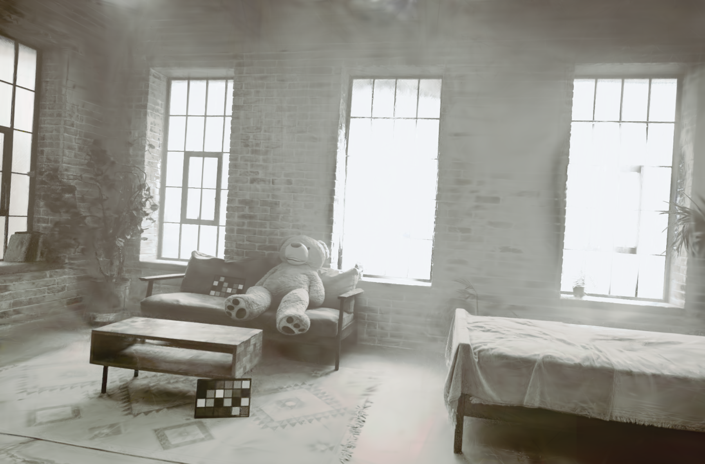
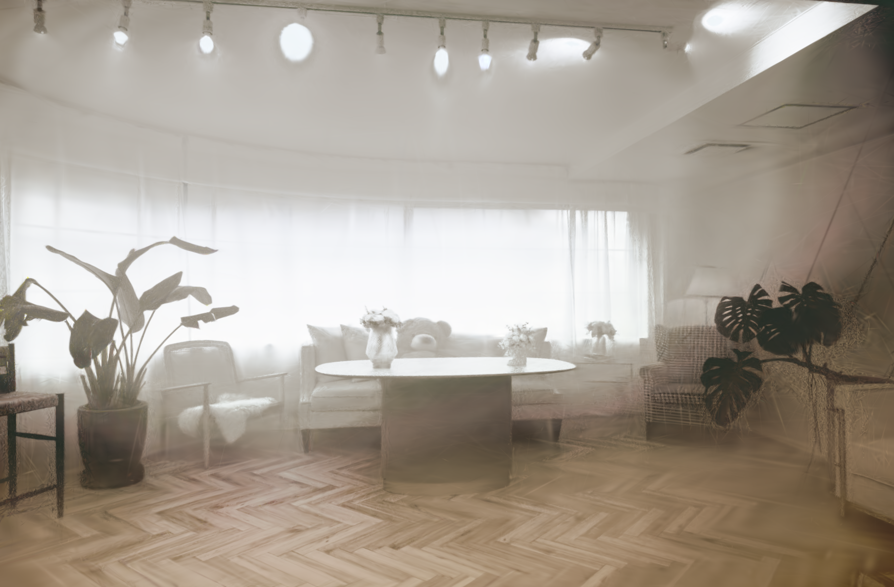

<p align="center">
  
</p>

<p align="center">
  <strong>Seeing Through Smoke with RAW-Domain Gaussian Splatting</strong><br>
  Gengjia Chang · Ziteng Cui · Shuhong Liu
</p>

<p align="center">
  <a href="#setup">Setup</a> ·
  <a href="#reconstruction">Reconstruction</a> ·
  <a href="#results">Results</a> ·
  <a href="#training">Training</a> ·
  <a href="#citation">Citation</a>
</p>


<details>
<summary>Method overview</summary>


Base ISP + RAW color flow + training-only Delta-ISP → static 3DGS.

</details>

## Setup

Linux · Python 3.9 · PyTorch 2.0.1 · CUDA 11.8. Run commands from the repository root.

<details>
<summary>Installation</summary>

```bash
conda create -n fujinsplat python=3.9 -y
conda activate fujinsplat
python -m pip install 'setuptools>=61' wheel
python -m pip install torch==2.0.1 torchvision==0.15.2 \
  --index-url https://download.pytorch.org/whl/cu118
python -m pip install -r requirements/synthesis.txt
python -m pip install --no-build-isolation ./submodules/diff-gaussian-rasterization
python -m pip install --no-build-isolation ./submodules/simple-knn
python -m pip install --no-build-isolation --no-deps -e .
```

</details>

Data and weights: Google Drive links coming soon.

<details>
<summary>Data layout</summary>

RAW NPZ: `linear_rgb`, H×W×3 uint16 or normalized float; no WB or gamma.

```text
DATA_ROOT/
  raw/smoke/SCENE/train/STEM.npz
  rgb/smoke/SCENE/train/STEM.JPG       # hazy camera RGB
  rgb/smoke/SCENE/test/STEM.JPG        # clean evaluation references
  rgb/smoke/SCENE/transforms_train.json
  rgb/smoke/SCENE/transforms_test.json
  rgb/smoke/SCENE/point3d.ply
  weights/controller.pt
  weights/base/SCENE/complete_model.pt
```

</details>

## Reconstruction

Set paths to the downloaded weights and data; use a new output directory.

```bash
export DATA_ROOT=/absolute/path/to/data
export WORK_ROOT=/absolute/path/to/new_run
export RAW_ROOT="$DATA_ROOT/raw/smoke"
export RGB_ROOT="$DATA_ROOT/rgb/smoke"
export BASE_ROOT="$DATA_ROOT/weights/base"
export CONTROLLER="$DATA_ROOT/weights/controller.pt"
export SCENES="Akikaze Futaba Hinoki Koharu Midori Natsume Shirohana Tsubaki"

for SCENE in $SCENES; do
  python -m fujinsplat scene --scene "$SCENE" \
    --raw-root "$RAW_ROOT" --rgb-root "$RGB_ROOT" --base-root "$BASE_ROOT" \
    --controller "$CONTROLLER" --controller-format weights \
    --prepared "$WORK_ROOT/prepared/$SCENE" --run "$WORK_ROOT/runs/$SCENE" \
    --renders "$WORK_ROOT/renders/$SCENE"
done

python -m fujinsplat evaluate --renders "$WORK_ROOT/renders" --rgb-root "$RGB_ROOT" \
  --output "$WORK_ROOT/evaluation" --variant FujinSplat --purpose final_readout
```

18k iterations · SH3 · Delta at 13k–16k. Outputs: `RESULT.json` and
`held_view_metrics.csv`; four held views per scene, equal-scene averaging.

## Results

Paper results: **18.42 dB PSNR · 0.679 SSIM · 0.541 LPIPS**.

<table>
<tr><th>Shirohana</th><th>Koharu</th><th>Futaba</th></tr>
<tr>
<td></td>
<td></td>
<td></td>
</tr>
<tr>
<td></td>
<td></td>
<td></td>
</tr>
</table>

<sub>Top: smoky RGB. Bottom: ft8000 reconstructions at the same source-camera poses.</sub>

[Per-scene paper metrics](configs/paper_results.json).

## Training

<details>
<summary>Calibrate the Base ISP and train the Controller</summary>

Before reconstruction, using the paths above. Requires L257 parent Bases,
16 calibration ARWs and Depth-Anything-V2-Small weights.

```bash
export BASE_ROOT="$WORK_ROOT/bases"
for SCENE in $SCENES; do
  python -m fujinsplat calibrate-base --scene "$SCENE" \
    --raw-root "$RAW_ROOT" --rgb-root "$RGB_ROOT" \
    --initial-parent "$DATA_ROOT/weights/parent_base/$SCENE/complete_model.pt" \
    --output "$BASE_ROOT/$SCENE" --device cuda:0
done

export INPUTS="$PWD/fujinsplat/data/synthesis_prerequisites"
export EXTERNAL_ROOT="$WORK_ROOT/external_raw"
export J_CACHE="$WORK_ROOT/j_cache"
export SYNTHETIC_ROOT="$WORK_ROOT/synthetic"

python -m fujinsplat.acquire_mit --output "$EXTERNAL_ROOT" \
  --scratch "$WORK_ROOT/raw_scratch" --workers 6
python -m fujinsplat external-cache --stage fit_matrix \
  --manifest "$DATA_ROOT/external_calibration/MANIFEST.json" \
  --output "$WORK_ROOT/external_matrix.json"
python -m fujinsplat external-cache --stage build_cache \
  --manifest "$EXTERNAL_ROOT/MANIFEST.json" \
  --matrix "$WORK_ROOT/external_matrix.json" --output "$J_CACHE"
python -m fujinsplat depth --j-cache "$J_CACHE" \
  --population "$INPUTS/raw_population_195.json" \
  --weights "$DATA_ROOT/weights/depth/model.safetensors" \
  --output "$WORK_ROOT/depth_t.json" --device cuda:0
python -m fujinsplat synthesize --j-cache "$J_CACHE" \
  --population "$INPUTS/raw_population_195.json" \
  --depth-t "$WORK_ROOT/depth_t.json" --camera-wb "$INPUTS/realx_camera_wb.json" \
  --output "$SYNTHETIC_ROOT" --scratch "$WORK_ROOT/synthesis_scratch" --workers 8
python -m fujinsplat train-controller \
  --manifest "$SYNTHETIC_ROOT/MANIFEST.json" --output "$WORK_ROOT/controller" \
  --steps 1500 --batch-size 16 --lr 0.0003 --seed 90202
export CONTROLLER="$WORK_ROOT/controller/checkpoint.pt"
```

Base: 100 + 400 updates. Controller: 1400 external RAWs and
[bundled statistics](fujinsplat/data/synthesis_prerequisites/MANIFEST.json).
Calibration manifest: `schema: fujinsplat.external_raw.v1`, with 16 `rows`
entries: `{"capture_id": "name", "raw": "/path/to/capture.ARW"}`.

CPU checks:

```bash
CUDA_VISIBLE_DEVICES='' OMP_NUM_THREADS=2 python -B -m unittest discover -s tests -v
```

49 tests pass; full GPU reproduction with final release weights is pending.

</details>

## Citation

```bibtex
@misc{chang2026fujinsplat,
  title={FujinSplat: Seeing Through Smoke with RAW-Domain Gaussian Splatting},
  author={Chang, Gengjia and Cui, Ziteng and Liu, Shuhong},
  year={2026}
}
```

Built on Graphdeco Gaussian Splatting. See [LICENSE](LICENSE.md).
